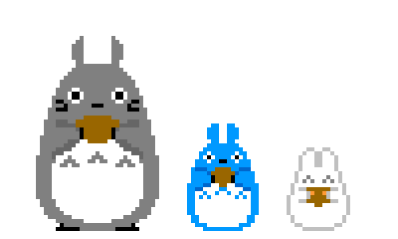

        
     
     
    

  

 
   

---

## <picture></picture> About Me

<picture> 
  <!--  -->
  
</picture>

- 🎓 IT student from Vietnam  
- 💻 Focused on **ReactJS (Frontend)** & **NodeJS (Backend)**  
- 🚀 Goal: Become a solid full-stack developer & work internationally  
- 📚 Learning mindset: disciplined, practical, project-driven  
- ⚡ Building real-world systems (blog, employee scheduling, etc.)

 

---

## <picture></picture> Tech Stack

### 💻 Programming Languages

  
  
  

### 🎨 Frontend

  
  
  
  

### ⚙️ Backend

  
  
  
  
  

### 🗄 Database

  
  
  

### 🛠 Tools

  
  
  
  

---

## <picture></picture> Projects

- 📂 Blog Management System (CRUD, LocalStorage, Ant Design UI)  
- 📊 Employee Scheduling System (shift management, real-world logic)  
- 🔧 REST APIs with authentication & structured architecture  

---

## <picture></picture> GitHub Stats

  
   
  

---

  

---

## <picture></picture> Connect With Me

  
  
  
   

